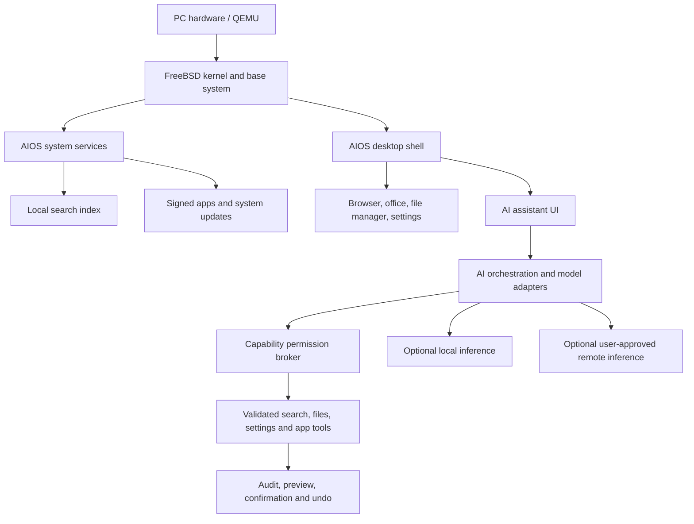

# Indian AIOS — complete product overview

## The product in one view

Indian AIOS is a FreeBSD-based, non-Linux desktop product whose original work focuses on an Indian-language-first shell, permissioned AI, local search, system settings, applications/integrations, and trusted updates. It uses mature upstream software where rebuilding it would slow delivery or reduce compatibility.

### Concept desktop

```text
┌──────────────────────────────────────────────────────────────────────────────┐
│ Indian AIOS  •  Mon 24 Sep  •  Wi-Fi  •  Sound  •  Battery  •  Notifications │
├──────────────────────────────────────────────────────────────────────────────┤
│                                                                              │
│  Search apps, files, settings, and documents…                 🎙 Speak      │
│                                                                              │
│  [ Files ] [ Writer ] [ Calc ] [ Slides ] [ Browser ] [ Assistant ]          │
│                                                                              │
│  Recent work                  Suggested actions                              │
│  • Project budget.xlsx        • Summarize this document                      │
│  • Hindi notes.odt            • Find settings for a second display            │
│  • Presentation.pptx          • Translate selected text                      │
│                                                                              │
├──────────────────────────────────────────────────────────────────────────────┤
│  ◉ Launcher   Search   Files   Browser   Writer   Terminal    ▣  ▴  🔊  🔋  │
└──────────────────────────────────────────────────────────────────────────────┘
```

This is a product concept, not a screenshot or implemented UI. The v0.1 development image currently uses upstream XFCE as a practical QEMU shell.

## What the finished system should include

### 1. Boot, login, and desktop shell

- Signed boot and recovery path, user login, accessibility choices, user/session switching.
- Distinct Indian AIOS visual design, launcher, taskbar/dock, window snapping, virtual desktops, notifications, clipboard, screenshots, and screen recording.
- First-run setup for language, keyboard, time zone, network, privacy, updates, and accessible display/speech options.
- Consistent dark/light themes, scale factors, large text, keyboard navigation, screen-reader interfaces, and high-contrast choices.

### 2. Indian-language layer

- English (India), Hindi, Tamil, and Telugu as the first planned language set; add further languages through measured expansion.
- Unicode fonts and shaping, on-screen and hardware keyboards, transliteration, locale-aware dates/numbers, searchable settings, UI translation workflow.
- Optional speech-to-text, text-to-speech, OCR, document translation, and spoken translation from local or remote providers only when quality and privacy criteria are met.
- Per-language coverage and quality dashboard. Installed strings do not count as validated input/speech support.

### 3. AI assistant and system tools

- One assistant UI that can answer questions or propose actions in files, settings, browser, and productivity apps.
- Separate model adapters, orchestrator, retrieval/indexer, tool APIs, permission broker, and UI.
- Local inference when the device supports it; remote services only after opt-in with visible data disclosure.
- Show a preview before changing files/settings; confirmation for deletion, install, external sharing, account changes, and privileged operations.
- Audit history, undo where feasible, app-specific permission grants, revocation, sandboxing, network policy, and safe failure behavior.
- Assistant outputs are proposals. Tools independently validate permissions, paths, and arguments.

### 4. Search and web

- One launcher search for applications, files, settings, and permitted document text.
- Local index stored on-device and controlled by the user. Exclusions, pause/rebuild, retention, and per-folder permissions are visible.
- Indian-language tokenization and transliteration treated as explicit quality work.
- Optional web metasearch provides source links and discloses external requests. A proprietary/global crawl index is not assumed.

### 5. Applications

- File manager, terminal, settings, system monitor, software center, and recovery tools.
- Chromium-based browser integration maintained with upstream security updates; own shell/extension integration evolves separately from the rendering engine.
- LibreOffice Writer, Calc, and Impress adapted as the first productivity path, with Indian templates, language tools, and permissioned AI features.
- Curated software catalog with signatures, license/provenance details, uninstall, updates, and rollback.
- Support for native FreeBSD applications first; compatibility technologies and web apps later, with each supported app tested and documented.

### 6. System services and hardware

- Networking, audio, Bluetooth, USB, printing, display, power, users, clock/locale, notifications, clipboard, and logs.
- Encryption at rest, process/application isolation, secure boot where supported, signed packages/system updates, recovery media.
- Tested x86-64 PC matrix; publish exact device models and known limits rather than “universal PC” claims.
- Offline core UI and low-bandwidth update/download strategies.

### 7. Developer and administration experience

- Reproducible source builds, QEMU test cycle, crash logs, integration tests, hardware matrix, software development kit, API docs.
- App capability manifests, sandbox APIs, localization tooling, and signed app distribution.
- Admin profiles for education labs/small organizations only after user/privacy controls and policy updates are defined.

## Architecture sketch



## Delivery reality

The v0.1 platform is an early technical foundation: FreeBSD 15.1, XFCE, a pinned VM base image, package install, and a QEMU smoke workflow. It is not the finished desktop. Later phases build the AIOS shell, Indian-language tools, search, application layer, secure updater, installer/recovery, hardware coverage, and accessibility. Each release must label implemented, tested, and planned functions separately.

